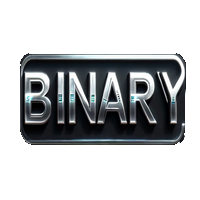

<p align="center">
	
</p>

<h1 align="center">Bin2Dec</h1>

<p align="center">
	<strong>AI that learned binary!</strong>
</p>

## 🚀 Overview

Welcome to **Bin2Dec**! This program allows you to train a model to learn how to convert binary to decimal. The program automatically generates binary values and their corresponding decimal numbers to train the model. The model can then be used to predict the decimal number of a given binary value.

## 🎨 Features

- **Storing the model:** The model is stored in a file called `model.bin`, so that the program can efficiently load the model without training every task instantiation.
- **Training the model:** The program automatically generates binary values and their corresponding decimal values to train the model.
	- Uses LFSR to generate binary values, so they are pseudo-random.

## 🛠️ Installation

To get started with the program, follow the steps below:

1. **Clone the repository**
```sh
git clone https://github.com/321BadgerCode/bin2dec.git
cd ./bin2dec/
```

2. **Compile the program**
```sh
g++ ./neural_network.cpp ./main.cpp -o neural_network
```

## 📈 Usage

To use the program, follow the instructions below:

1. **Run the program**
```sh
./neural_network <binary value>
```

## 📜 License

[LICENSE](./LICENSE)